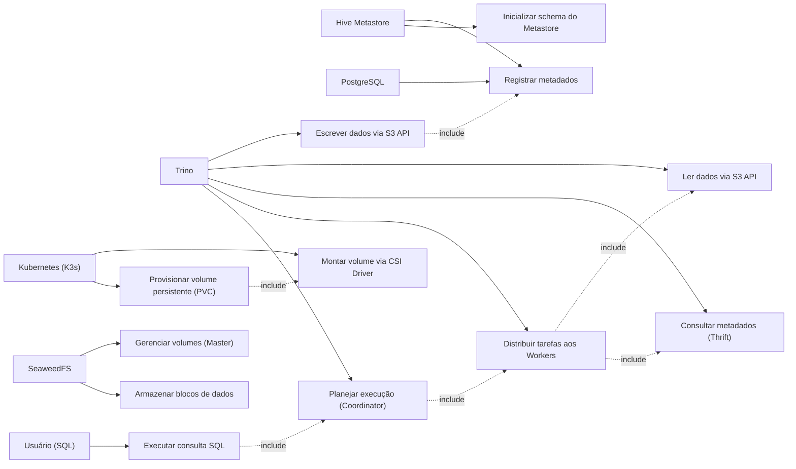

### Requitements do projeto

Instalação das dependências do projeto:
```bash
ansible-galaxy install -r requirements.yml
```
---

## Verificação dos serviços SeaweedFS

| Serviço               | URL                               | Descrição                                                                 |
|-----------------------|-----------------------------------|---------------------------------------------------------------------------|
| SeaweedFS Master      | http://192.168.56.101:9333        | Painel de status do cluster (volumes ativos, health checks)               |
| SeaweedFS Filer       | http://192.168.56.101:8888        | Interface web tipo "Google Drive" para navegar pelos arquivos do data lake |
| SeaweedFS S3 Gateway  | http://192.168.56.101:8333        | Endpoint compatível com S3 (retorna XML com informações do bucket)        |
| Trino                 | http://192.168.56.102:8080        | Interface web do Trino (login: `admin`, sem senha)                        | 

## Diagramas


## Caso não faça sentido o K8 ao seu projeto:

### 1. Remover do ansible/enventory/hosts.ini  
```bash
[k8s]
k8s-node ansible_host=192.168.56.103 ansible_user=vagrant ansible_ssh_private_key_file=.vagrant/machines/k8s-node/virtualbox/private_key
```

### 2. Remover do ansible/playbook.yml
```bash
- name: "Configuração do Nó Kubernetes (VM 3)"
  hosts: k8s
  become: yes
  roles:
    - role: k8s-seaweed-csi
      tags: k8s-seaweed-csi
```

### 3. Remover do `Vagrantefile`
```bash
# VM 3: Kubernetes Node (K3s)
  config.vm.define "k8s-node" do |node|
    node.vm.box = "ubuntu/focal64"
    node.vm.hostname = "k8s-node"
    node.vm.network "private_network", ip: "192.168.56.103"
    node.vm.provider "virtualbox" do |vb|
      vb.memory = "1024"
      vb.cpus = 1
      vb.name = "k8s-node"
    end
  end
```

### 4. Remover do `setup.sh` apenas o ***"k8s-node:key_k8s"*** do `for` de dentro do loop.
```bash
# Adicionei a VM3 (k8s-node) que planejamos anteriormente na lista
for VM in "seaweedfs-node:key_seaweed" "trino-sea-node:key_trino" "k8s-node:key_k8s"; do
  VM_NAME="${VM%%:*}"
  KEY_NAME="${VM##*:}"
  DEST="$SSH_DIR/$KEY_NAME"
  ```

## Outros comandos

### Utilizando TAGs
```bash
ansible-playbook -i ansible/inventory/hosts.ini ansible/playbook.yml --tags "seaweed"

# ou

./setup.sh --tags seaweed
```